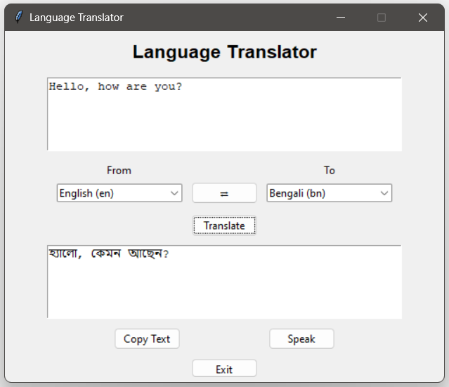

# Language Translator

## Description

The Language Translator is a Python-based application that enables seamless text translation between multiple languages. Built using Tkinter for the graphical interface and Google Translate API for translations, it provides an intuitive way to translate text instantly. Users can select source and target languages, input text, and receive translations with a single click. Additionally, the application features text-to-speech functionality for supported languages and includes options to copy translated text and swap languages effortlessly.

## Features

1. **Multi-Language Support**

   - Supports translation between 100+ languages for global communication.
   - Users can select source and target languages from a dropdown menu.

2. **User-Friendly GUI**

   - Developed using Tkinter for a simple and intuitive interface.
   - Provides clear input and output sections for better user experience.

3. **Real-Time Translation**

   - Translates text instantly upon clicking the "Translate" button.
   - Displays the output without delays or manual refreshing.

4. **Copy and Paste Functionality**

   - Users can copy translated text with one click for convenience.
   - Paste any text from other applications for quick translation.

5. **Text-to-Speech (TTS) Integration**

   - Reads out translated text for an improved language learning experience.
   - Uses Google Text-to-Speech (gTTS) for voice synthesis (supports many but not all languages).

6. **Language Swapping**

   - A "Swap" button allows users to quickly switch between source and target languages.

7. **Exit Button**

   - Allows users to close the application with a single click.

## Installation and Requirements

### Prerequisites

Ensure you have Python installed on your system. You can download and install it from the [official Python website](https://www.python.org/downloads/).

### Install Required Python Modules

The following Python modules are required to run the application. If the modules are not installed, install the necessary dependencies using pip by running the following command:

1. **Tkinter** (Built-in with Python) - Used for creating the graphical user interface (GUI). If Tkinter is not installed, install it using:
   ```sh
   pip install tk
   ```
3. **googletrans==4.0.0-rc1** - Used for translating text between multiple languages.
   ```sh
   pip install googletrans==4.0.0-rc1
   ```
5. **gtts (Google Text-to-Speech)** - Converts translated text into speech for supported languages.
   ```sh
   pip install gtts
   ```
7. **pygame** - Used to play the generated speech audio.
   ```sh
   pip install pygame
   ```

#### Verify Installation
After installation, verify that the required packages are installed by running:
```sh
pip list
```
Ensure that `googletrans`, `gtts`, and `pygame` appear in the list.

## How to Use

1. Run the script using:
   ```sh
   python language_translator.py
   ```
2. Enter text in the input field.
3. Select source and target languages from the dropdown menus.
4. Click the "Translate" button to get the translation.
5. Click "Copy Text" to copy the translated text.
6. Click "Speak" to hear the translated text (if supported).
7. Use the "Swap" button to interchange the selected languages.
8. Click "Exit" to close the application.

## Application Interface

Here is a preview of the Language Translator application:




## Known Limitations

- Some languages may not support text-to-speech functionality.
- Internet connection is required for translation and TTS.
- The accuracy of translations depends on the Google Translate API.


